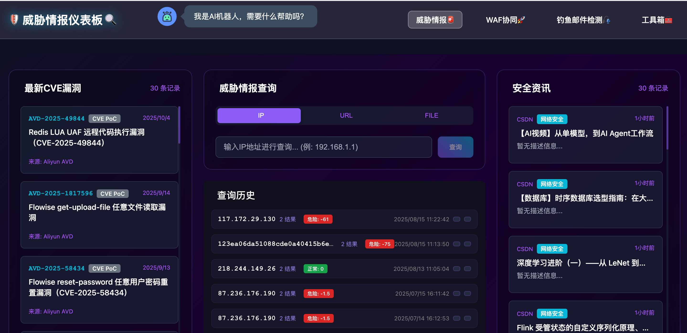
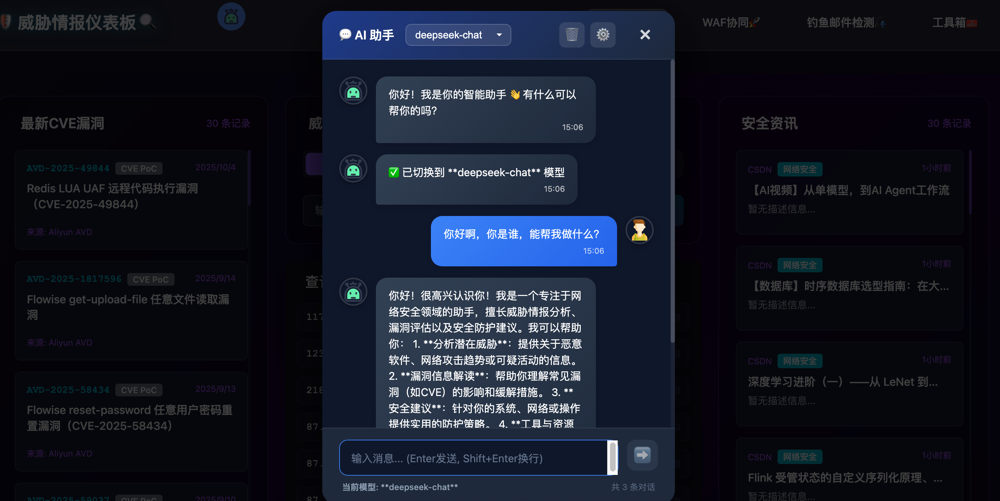
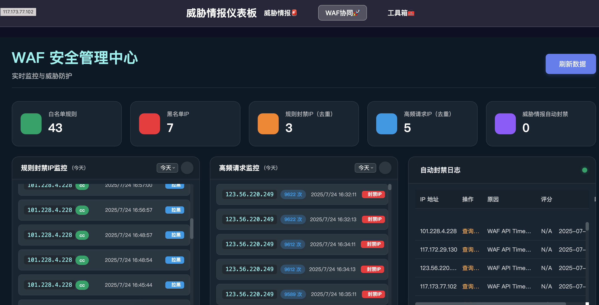
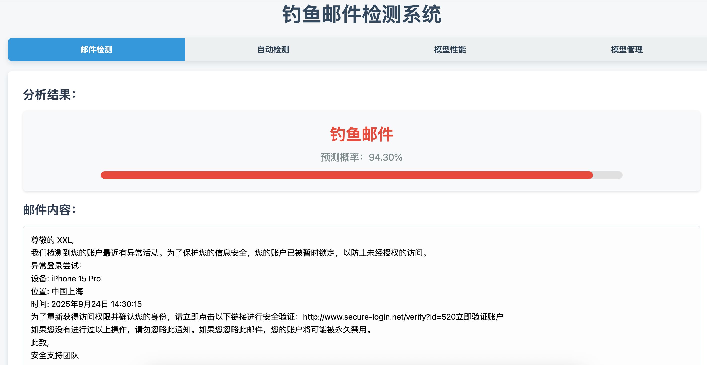
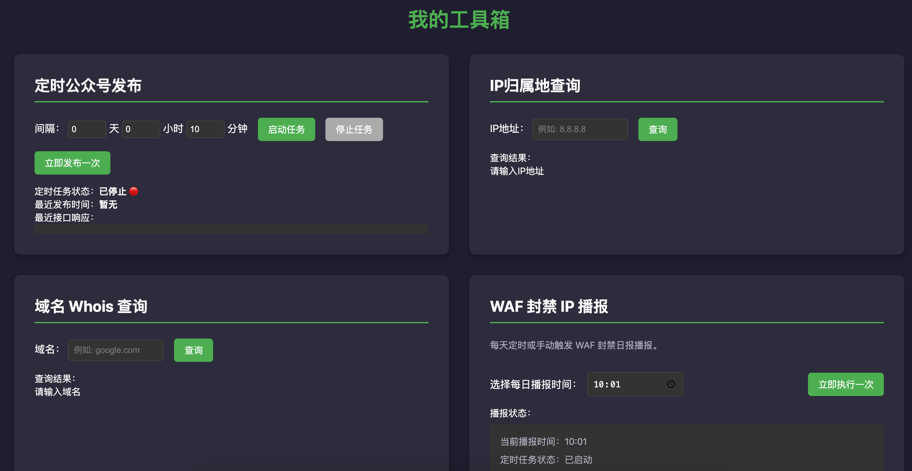

# 威胁协同平台 (Threat Intelligence Hub)

🔥 一个集成多源威胁情报的聚合平台，为安全研究人员和运维团队提供实时威胁情报查询和播报服务;集成阿里云WAF主动拦截威胁IP，钓鱼邮件实时监测，集成AI等多项常用安全类工具🔧   
---   

## 在线文档
[Threat Intelligence Hub在线文档](https://www.yuque.com/weare/mx0zcy/vrqwsxe3vgtesate?singleDoc#)

## 最近更新
### 2025-10-15
- 新增支持批量邮箱钓鱼邮件检测能力
- 新增支持在线手动上传钓鱼邮件数据集
- AI机器人🤖支持多模型切换，已实测豆包、deepseek
- AI、邮箱相关配置从.env文件中移除，改为数据库保存配置

### 2025-09-28
- 增加钓鱼邮件检测模块，支持检测钓鱼邮件，并返回钓鱼邮件的检测结果
- 钓鱼邮件检测支持手动输入和自动获取收件邮件进行检测
- 基于机器学习、模型训练和规则匹配的钓鱼邮件检测算法

[查看完整更新日志](./CHANGELOG.md)

---   
**威胁情报截图展示**
   
   
---   
**WAF协同截图展示**。 
    
---
 **钓鱼邮件检测**。 
    
---   
**Tools截图展示**。 
      
---
## 👥 目标用户

### 🛡️ 安全运维团队
快速查询可疑IP、URL的威胁情报，辅助安全事件分析；监控网络流量中的恶意IP和域名，及时发现安全威胁；自动化威胁检测和响应

### 🔍 安全研究人员
查询文件哈希值，快速识别恶意样本；利用多源情报进行威胁狩猎和溯源分析；获取最新CVE信息，跟踪漏洞披露和利用情况

### 🏢 企业安全团队
通过威胁情报播报了解最新安全态势；检测内网资产是否存在已知威胁；获取威胁情报报告，满足合规要求;实时检测钓鱼邮件并告警

## 🎯 使用场景
**让安全运营从被动变为主动**
### 🚨 日常安全运营
- **告警分析**: 当SIEM系统产生安全告警时，快速查询相关IP、域名的威胁情报
- **日志分析**: 分析Web访问日志、防火墙日志中的可疑访问源
- **网络监控**: 实时监控网络流量，识别与已知恶意IP的通信
- **邮件安全**: 检测钓鱼邮件中的恶意链接和附件

### 🔬 威胁情报分析
- **APT溯源**: 通过IP、域名关联分析，追踪高级持续威胁
- **恶意软件分析**: 查询样本哈希值，获取恶意软件家族信息
- **IOC扩展**: 基于已知威胁指标，发现更多关联的威胁情报
- **威胁态势感知**: 分析威胁趋势，预测潜在安全风险

### 🎯 应急响应
- **事件响应**: 安全事件发生时，快速获取攻击者的威胁情报
- **取证分析**: 数字取证过程中，查询可疑文件和网络连接
- **威胁遏制**: 基于威胁情报，快速制定防护策略
- **损失评估**: 评估安全事件的影响范围和潜在损失

### 🔧 自动化集成
- **SIEM集成**: 集成到Splunk、ELK、QRadar等SIEM平台
- **SOAR集成**: 集成到Phantom、Demisto等SOAR平台
- **API调用**: 通过API接口集成到自研安全工具
- **脚本自动化**: 编写Python/Shell脚本，实现自动化威胁检测


## 🚀 功能特性

### 📊 每日威胁情报播报
- **自动化CVE播报**: 每日定时获取最新CVE漏洞信息
- **多源情报聚合**: 整合阿里云、官方CVE数据库等权威威胁情报源；集成Freebuf、CSDN等安全资讯源
- **实时更新**: 每3小时自动刷新情报数据，确保信息时效性

### 🔍 威胁情报查询
- **IP地址查询**: 快速查询IP地址的威胁情报和恶意行为记录
- **URL安全检测**: 检测URL的安全性和潜在威胁
- **恶意文件分析**: 支持文件哈希值查询，识别恶意软件

### 🗄️ WAF协同能力（Aliyun）
**每分钟分析一次🧱**
- **威胁实时分析**: 自动查询15分钟内WAF规则封禁IP和5分钟内高频请求IP
- **威胁IP自动辨别**: 根据WAF自身的封禁IP和高频请求IP，自动识别威胁IP
- **威胁IP自动封禁**: 识别出的风险IP（信誉分小于-5），自动封禁（黑名单）

### 🎣钓鱼邮件检测
- **邮件检测**: 支持手动输入和自动获取收件邮件进行检测
- **钓鱼邮件识别**: 基于机器学习、模型训练和规则匹配的钓鱼邮件检测算法
- **检测结果**: 返回钓鱼邮件的检测结果，包括邮件标题、发件人、收件人、邮件内容等

### 😯 其他
- **微信公众号周期发布**: 增加了微信公众号每天发布最新cve漏洞信息和安全类咨询头条（可去微信公众号【安全info】查看效果）
- **IP归属地查询**: 支持查询IP的归属地、运营商、ASN信息
- **域名Whois查询**: 支持查询域名的Whois信息
- **AI机器人**: 支持用户与AI进行对话（暂时只接了豆包）


## 🛠️ 技术栈

- **后端框架**: Python Flask
- **数据库**: MySQL 8.0+
- **前端**: Vue.js 或 React

## 📦 快速开始 && 部署方式
### 本地部署
#### 环境要求
- Python 3.8+ 或 Node.js 16+
- MySQL 8.0+

#### 安装步骤
脚本一件安装
```bash
./deploy.sh
```
**注意：程序运行端口默认为8891**

#### 🔧 配置说明

##### 环境变量配置
```env
# .env
ENV=pro

DB_TYPE=mysql
MYSQL_HOST=threat-intel-hub-db   # 要和docker-compose.yml中的db服务名一致 
MYSQL_PORT=3306           
MYSQL_USER=root
MYSQL_PASSWORD=threat_intel # 数据库默认密码
MYSQL_NAME=threat_intel # 数据库名称

# threat intel
virustotal_api_key=xxx 
otx_api_key=xxx
reputation_score=-50
highfreq_ip_count=6000

# system
file_log=app.log

# WAF API INFO
INSTANCE_ID=''
REGION_ID=''
ALIBABA_CLOUD_ACCESS_KEY_ID=''
ALIBABA_CLOUD_ACCESS_KEY_SECRET='' 
SLS_PROJECT_NAME=''
SLS_LOGSTORE_NAME=''
WHITELIST_TEMPLATE_ID=''
BLACKLIST_TEMPLATE_ID=''
BLACKLIST_RULES_ID=''
DDINGTALK_WEBHOOK_URL=''

# 微信公众号
wx_appid=''
wx_secret=''
```
### Docker部署（推荐）
Docker Hub搜索🔍：monday1/threat-intel-hub:latest
```bash
# 下载仓库代码到本地
git clone https://github.com/HaoY-l/threat-intel-hub.git
# 进入项目目录
cd threat-intel-hub
# 创建.env文件并配置环境变量，记得添加正确的配置
mv .env.example .env
# 后台执行
docker compose up -d
```

**这里可能出现应用启动失败，可以手动启动app容器，原因是mysql还没有完全起来就开始连接mysql导致**


### 数据源配置
支持的威胁情报源：
- **阿里云威胁情报**: 最新CVE漏洞信息
- **CVE官方数据库**: 最新CVE漏洞信息
- **VirusTotal**: 提供IP、域名、文件威胁情报，声誉查询
- **AlienVault OTX**: 提供IP、域名、文件威胁情报，声誉查询
- **其他开源情报源**: 可根据需求扩展
**目前CVE仅展示了阿里云漏洞平台的漏洞信息，IP、URL、File检测依赖了VirusTotal和AlienVault OTX的API**


## 🔄 工作流程

### 数据更新流程
1. **定时任务**: 每3小时执行一次数据更新
2. **数据获取**: 从各威胁情报源获取最新数据
3. **数据处理**: 清洗、去重、格式化数据
4. **数据存储**: 将处理后的数据存储到MySQL数据库
5. **状态更新**: 更新数据时间戳和状态信息

### 查询处理流程
1. **请求接收**: 接收用户查询请求
2. **缓存检查**: 检查MySQL中是否有7天内的缓存数据
3. **缓存命中**: 如有缓存且未过期，直接返回缓存数据
4. **API调用**: 缓存未命中时，调用外部API获取数据
5. **数据缓存**: 将API返回的数据存储到数据库
6. **结果返回**: 返回查询结果给用户  

### WAF威胁自动封禁
- **威胁实时分析**: 自动查询15分钟内WAF规则封禁IP和5分钟内高频请求IP
- **威胁IP自动辨别**: 根据WAF自身的封禁IP和高频请求IP，自动识别威胁IP
- **威胁IP自动封禁**: 识别出的风险IP（信誉分小于-5），自动封禁（黑名单）

---
 

## Star History
**⭐ 如果这个项目对你有帮助，请给我们一个星标！**
[](https://www.star-history.com/#HaoY-l/threat-intel-hub&Date)
---

## 🏢 Who's Using This Project

We’re proud that our project is trusted by awesome teams around the world 🌍


| Logo / Name | Description |
|--------------|--------------|
| [Threat-Intel-Hub](https://github.com/HaoY-l/threat-intel-hub) | 作者✍️ | 
| [中铁信（北京）网络技术研究院有限公司智能技术部](-) | ㊙️ | 


> 💬 If your company is using this project, feel free to open a PR and add your logo here!


## 有任何问题请联系作者✍️进群也请加作者微信
**项目不得用于任何非法用途，一切行为自行承担后果，与作者无关；若该工具的任何行为有违规请联系作者✍️**。 
 


